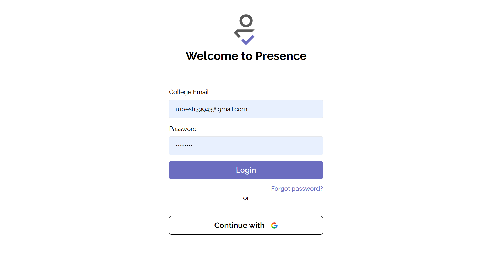
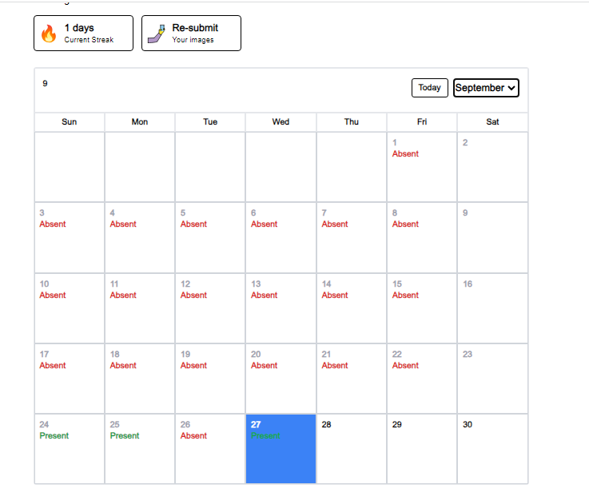

# Presence: Automated Attendance System

## Made with

- Django/Python (REST APIs, Websockets and ML functionalities), opencv, face-recognition
- Nextjs, Typescript, TailwindCSS

> `docs` folder includes university project documentation made with overleaf

## How to run

- Clone the repo
- Go to the backend folder
  - Create a virtual environment using `python -m venv .venv`
  - Activate the virtual environment using `.venv\Scripts\activate`
  - Install the dependencies using `pip install -r requirements.txt`
  - Copy the `.env.example` file to `.env` and fill the values
  - Run the migrations using `python manage.py migrate`
  - Create a superuser using `python manage.py createsuperuser`
  - Run the server using `python manage.py runserver` or `daphne presence.asgi:application` to run the server with asgi configuration to handle both http and websocket requests
- Go to the frontend folder
  - Install the dependencies using `yarn install`
  - Copy the `.env.example` file to `.env.local`
  - Run the server using `yarn dev`
- Go to `localhost:3000` to see the app running

## Screenshots

- Auth
  
  
  
  
  

- Student View
  
  
  
  _Student can submit images which then will be used to train the model_

- Admin View

  
  _Admin can train the model using the images submitted by the students_

  
  
  _Admin can take attendance using the webcam, it will recognize the student and mark their attendance_

  
  _Admin can see the list of students and can remove or add them_
